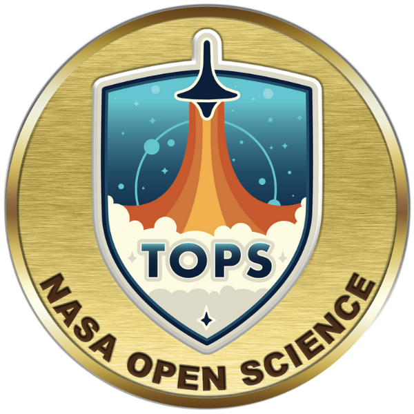

Hi, I'm Marcus. 

- I work at the [Southwest Research Institute in Boulder, CO](https://www.boulder.swri.edu/). 
- One of my main priorities is developing the Science Operations Center data reduction pipeline for [PUNCH](https://punch.space.swri.edu/), an upcoming NASA mission to study the solar environment. [Watch our code get released!](https://github.com/punch-mission)
- I also work on the [CubIXSS mission](https://github.com/CubIXSS). 
- I'm interested in machine learning applications in solar physics, with specific experience in [thematic maps](https://www.swsc-journal.org/articles/swsc/pdf/2019/01/swsc180074.pdf). I'm working on an improved version called [CORD Maps](https://github.com/jmbhughes/cordmap).  
- I'm building [Barnsley, a Rust app to explore iterated function systems,](https://github.com/jmbhughes/barnsley)with a [web-based GUI](https://jmbhughes.com/barnsley_gui/). 

